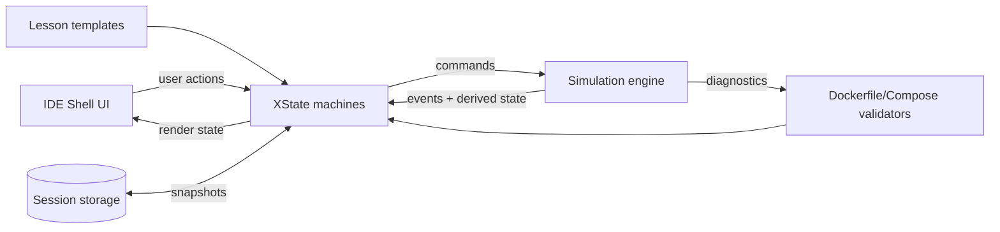

<div align="center">

# 🚢 Docker Yard IDE Simulator

### Learn Docker by _doing_ — right in your browser.

**A no-backend, interactive Docker IDE simulator** that teaches you how to write `Dockerfile`s and `compose.yml` files through hands-on practice — with real-time diagnostics, a visual container yard, and guided lessons.

[](LICENSE)
[](https://nodejs.org)
[](https://github.com)
[](CONTRIBUTING.md)

> Inspired by [learngitbranching.js.org](https://learngitbranching.js.org) — but for Docker.

</div>

---

## What is Docker Yard?

Docker Yard is a **fully in-browser Docker learning environment**. No Docker installation required. No backend. Just open the app and start typing commands.

- Write `Dockerfile`s and `compose.yml` files in a Monaco-powered editor
- Run simulated Docker CLI commands in a real terminal emulator
- Watch your containers, images, networks, and volumes appear in a visual **Container Yard**
- Get instant diagnostics — errors, warnings, and best-practice hints as you type
- Follow guided lessons or explore freely

---

## ✨ Features

### 🖥️ Mini Browser IDE

- File explorer with `Dockerfile`, `compose.yml`, `.env`, and `app/*` workspace
- Monaco-style editor with tabs and split-view support
- **Inline diagnostics** — errors and warnings rendered as editor markers
- Terminal dock with command history and `Ctrl+L` clear

### ⚙️ Simulation Engine

Event-sourced and deterministic: every command produces events, every event updates state.

| Component        | What you see                                  |
| ---------------- | --------------------------------------------- |
| **Containers**   | Status, ports, env vars, logs                 |
| **Images**       | Layer stack with cache hit/miss indicators    |
| **Networks**     | Visual tracks and cable connections           |
| **Volumes**      | Mount state                                   |
| **Event Stream** | Full timeline — "what just happened and why?" |

### 📚 Learning Mode

- Scenario templates that load into the workspace
- Progress checks based on state + command history
- **"Explain last action"** — derived from the event stream, not magic strings

---

## 🚀 Quickstart

**Prerequisites:** Node.js 18+ (20+ recommended)

```bash
# 1. Install dependencies
npm install       # or pnpm install / yarn

# 2. Start dev server
npm run dev

# 3. Open in browser
open http://localhost:3000
```

**Build for production:**

```bash
npm run build
npm run start
```

---

## 🧭 Walkthrough

1. **Pick a lesson or free play**
    - Use the lesson picker in the top bar to start guided steps.
    - Or stay in sandbox mode to explore freely.

2. **Open a file and edit**
    - Use the Explorer to open `Dockerfile` or `compose.yml`.
    - The editor highlights errors and warnings as you type.

3. **Run Docker commands**
    - Use the terminal to run commands like `docker pull nginx` or
      `docker compose up -d`.
    - The engine updates the yard with containers, images, networks, and volumes.

4. **Verify progress**
    - The status bar shows your current objective and error count.
    - Use the Event Log to review what the engine just did and why.

5. **Restore your session later**
    - On reload, the app can restore your workspace and engine state.
    - Choose **Restore** to continue where you left off, or **Start fresh**.

---

## 💾 Session Persistence

- Workspace and engine state are saved to `localStorage` with a versioned key.
- Pending commands and transient errors are cleared on save to keep snapshots stable.
- To discard a saved session, choose **Start fresh** when prompted.

---

## 🧠 What You'll Learn

### Docker CLI — without installing Docker

Practice commands safely. The engine simulates state transitions and produces realistic terminal output.

### How to write a correct `Dockerfile`

| Type                         | Examples                                                                         |
| ---------------------------- | -------------------------------------------------------------------------------- |
| **Errors** (blocking)        | Missing `FROM`, unknown instruction, invalid `ENV` format, bad `COPY`/`ADD` args |
| **Warnings** (best practice) | Pinning `:latest`, combining `RUN` steps, adding `.dockerignore`                 |

### How to write a correct `compose.yml`

| Type                         | Examples                                                                    |
| ---------------------------- | --------------------------------------------------------------------------- |
| **Errors** (blocking)        | YAML parse errors, missing `services`, invalid `ports`/`environment` format |
| **Warnings** (best practice) | Unpinned image versions, ambiguous defaults, implicit network/volume usage  |

---

## 🧩 Supported Commands

> A focused, learnable subset — also documented in-app via `docker help`.

**Docker CLI**

```
docker pull <image[:tag]>
docker images
docker run [--name <n>] [-d] [-p host:container] [-e KEY=VAL] <image>
docker ps [-a]
docker stop / start / rm <name|id>
docker logs <name|id>
docker exec <name|id> <cmd>
```

**Build (from workspace)**

```
docker build -t <tag> .
```

Reads your `Dockerfile`, validates it, simulates the build with layer logs and cache behavior.

**Compose (from workspace)**

```
docker compose up -d
docker compose ps
docker compose logs
```

Reads your `compose.yml`, validates it, and creates services/networks/volumes in the yard.

---

## 🏗️ Architecture

Single-repo, no backend, no server. Everything runs in the browser.

### Functional Overview

- UI panels dispatch intent to XState machines.
- Machines translate intent into engine commands, then reconcile engine events into UI state.
- The engine parses and validates `Dockerfile`/`compose.yml`, runs command handlers, and emits a deterministic event stream.
- Session snapshots are persisted to `localStorage` for restore.

### Project Structure

```
src/
├── app/                 # Next.js app router (layout, page, globals)
├── components/          # IDE shell + shared UI components
│   ├── shell/           # Panels: editor, terminal, yard, lesson flow
│   └── ui/              # Button, tabs, tooltip, etc.
├── engine/              # Pure TypeScript simulation core (no React/DOM)
│   ├── commands/        # CLI parser + command handlers
│   ├── validators/      # Dockerfile + Compose validators
│   ├── parser.ts        # CLI parse entry point
│   └── schema.ts        # Compose schema helpers
├── lessons/             # Scenario templates + lesson index
├── lib/                 # Storage, lesson utils, shared helpers
├── machines/            # XState actors (engine, IDE, lessons, terminal)
├── __tests__/           # Parser/evaluator unit tests
└── types/               # Ambient type declarations
```

### System Diagram



**Design principles:**

- **Event sourcing** — every action yields events; state is always derived, never mutated directly
- **Explainability** — "Explain last action" is powered by the same event stream, not hardcoded strings
- **Reviewable slices** — small, self-contained commits for careful code review

---

## 🧪 Scripts

```bash
npm run dev       # Start dev server
npm run build     # Production build
npm run start     # Serve production build
npm run lint      # Lint
npm run format    # Format
```

---

## 🗺️ Roadmap

- [x] Project scaffolding + README
- [x] IDE shell — Explorer + Editor + Visualizer + Terminal
- [x] Engine core — event sourcing, `help` command
- [x] Terminal bridge (xterm.js)
- [x] CLI MVP — `pull`, `run`, `ps`, `logs`, `exec`
- [x] In-memory workspace filesystem
- [x] Monaco editor + tabs
- [x] Diagnostics v1 — Dockerfile + Compose markers
- [x] Build simulation — layers + cache hints
- [x] Compose simulation — services graph
- [x] Lessons + scenario templates
- [x] Autocomplete + "Explain last action"

---

## 🤝 Contributing

Contributions are very welcome.

1. Fork the repo and create a feature branch
2. Keep commits small and focused — one logical change per PR
3. Open a PR with:
    - What changed and why
    - How to verify manually
    - Screenshots/GIFs if the UI changed

**Proposing a new Docker/Compose diagnostic rule?** Please include:

- A valid example (should pass)
- An invalid example (should fail/warn)
- A concise, user-friendly message explaining _why_

All rules must be deterministic and explainable.

---

## 🔐 Security

Docker Yard runs **entirely in the browser** and executes no real Docker commands. If you discover a security issue (e.g., an XSS vector via crafted file content), please open an issue with reproduction steps.

---

## 📄 License

[MIT](LICENSE) — free to use, fork, and build on.

---

## 🙏 Acknowledgements

- Learn-by-doing inspiration: [learngitbranching.js.org](https://learngitbranching.js.org)
- Terminal UI: [xterm.js](https://xtermjs.org)
- Editor UI: [Monaco Editor](https://microsoft.github.io/monaco-editor/)
- State modeling: [XState](https://xstate.js.org)

---

<div align="center">

**⭐ Star the repo if you find it useful — and let us know what Docker "gotchas" the simulator should teach next!**

</div>
